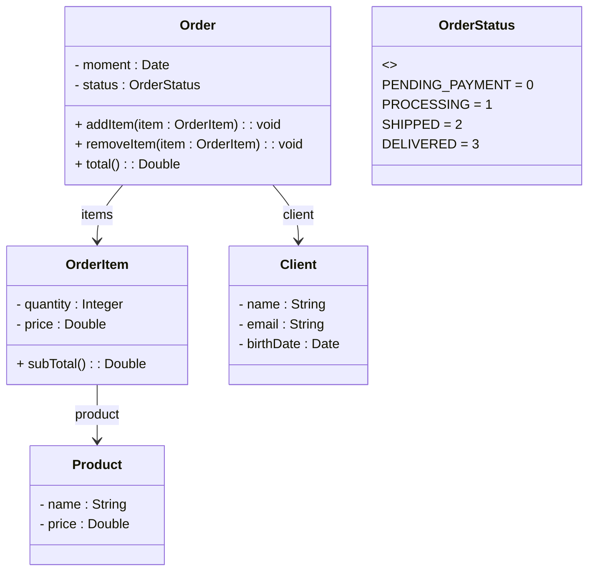

# Exercicio de Composicao-JAVA-
Exercicio de composicação em JAVA. Abaixo, segue o diagrama de classe o qual o exercício foi baseado.

##Enunciado
Ler os dados de um pedido com N itens (N fornecido pelo usuário). Depois, mostrar um 
sumário do pedido conforme exemplo (próxima página). Nota: o instante do pedido deve ser 
o instante do sistema: new Date()

